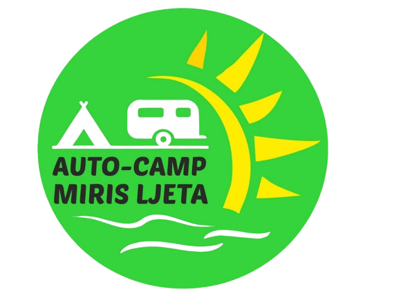

# Miris Ljeta Autocamp Reservation System

"

Welcome to the Miris Ljeta Autocamp Reservation System project! This desktop application, developed as part of the "Razvoj programskih rješenja" course, allows you to manage reservations, rooms, and users for the Miris Ljeta autocamp in Ostrozac.

## Overview

- **Technology Stack**: Java, JavaFX, MySQL Workbench, FreeDB
- **Development Environment**: IntelliJ IDEA, Scene Builder
- **Architecture**: MVC (Model-View-Controller)

## Features

### Admin Panel

- View all reservations, users, and rooms.
- Add, update, or delete rooms and reservations.
- Access a "My Profile" page to view login data.

### User Panel

- Make reservations for the autocamp.
- View and manage your reservations.
- Access a "My Profile" page to view your data.

### Additional Pages

- "About Us": Learn more about Miris Ljeta autocamp.
- "Sign In" and "Sign Up" pages for user authentication.

## Getting Started

1. Clone this repository.
2. Import the project into IntelliJ IDEA.
3. Set up your MySQL database using MySQL Workbench.
4. Configure database connection parameters in the application.
5. Build and run the application.
